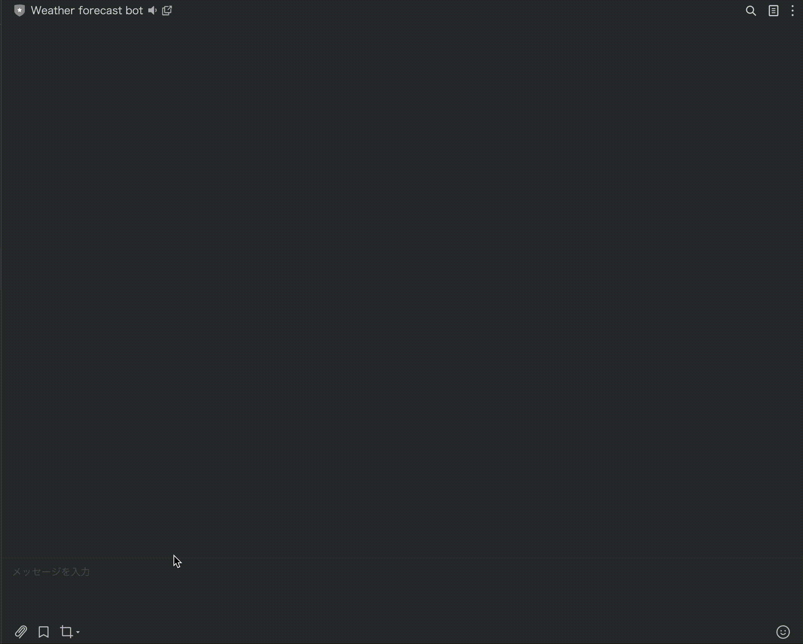

<h1 style="text-align: center;">
    Weather forecast bot
</h1>

<div align="center">

[LINE Messaging API](https://developers.line.biz/en/reference/messaging-api/) and [Open Weather API](https://openweathermap.org/api).

</div>



## Description

This bot will post a 4-day weather forecast for the city you would like to know about. All you have to do is POST the city name.

## Technologies Used

<p align="left">

</p>

## How to start building

You can build a this bot by following the steps below

### Clone the repository

```sh
git clone https://github.com/yuya-minamide/weather-forecast-bot.git
```

### Install

```sh
npm install express
```

### Download ngrok

- [Download ngrok](https://ngrok.com/download)

### Create LINE bot channel

- [Create LINE bot channel](https://developers.line.biz/en/)

### Create Open weather API key

- [Create Open weather API key](https://home.openweathermap.org/api_keys)

### Set secret key in .env file.

```sh
LINE_ACCESS_TOKEN=
LINE_CHANNEL_SECRET=
OPEN_WEATHER_API_KEY=
```

### Start the bot

1. Set webhook URL which is created by ngrok

```sh
npm start
```

2. Activate ngrok with Port 8080

```sh
ngrok http 8080
```

3. Set webhook URL which is created by ngrok
   

4. Send message

## Documentation

- [LINE Messaging API](https://developers.line.biz/en/reference/messaging-api/)
- [Open Weather API](https://openweathermap.org/api)
- [ngrok](https://ngrok.com/docs/getting-started)
- [npm](https://docs.npmjs.com/)

## Contributors

- [Yuya Minamide](https://github.com/yuya-minamide)
  [](https://www.linkedin.com/in/yuya-minamide/)
